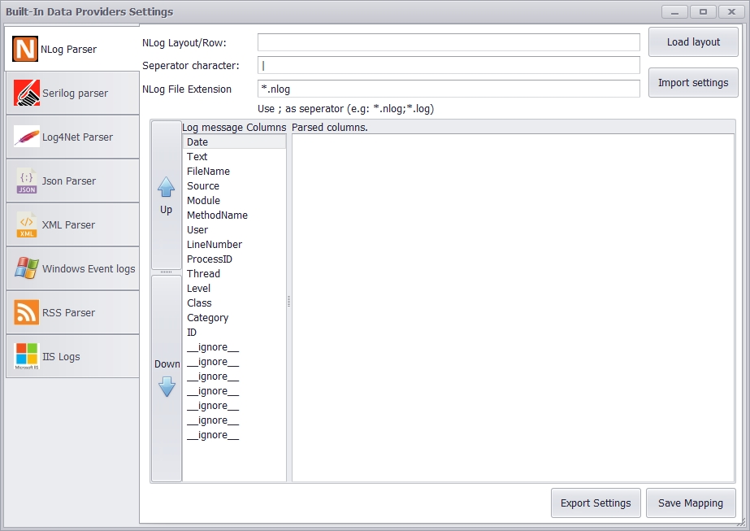

# Overview       
 Overview of projects and their repositories
 
# Analogy Log Viewer

Analogy Log Viewer is multi purpose Log Viewer for Windows Operating systems (with built-in Parser for most commonly used log frameworks).

The application has many standard operations for analysis logs (like filtering, excluding) but its strength is in the ability to add additional custom data sources by implementing few interfaces.
This allows adding any logs formats and/or custom modification of logs before presenting the data in the UI Layer.
Some features of this tool are:
1.	Windows event log support (evtx files)
2.	Logs aggregation into single view.
3.	Search in multiple files
4.	Combine multiple files
5.	Compare logs 
6.	Themes support
7.	64 bit support
8.	Personalization (users settings per user) 
9.	Columns extension to add more columns specific to the data source implementation
10.	Exporting to Excel/CSV files

# Log Viewer Application
The main Analogy Log Viewer app resides at the following repositories:
- [Analogy Log Viewer (DevExpress 19.1.9 version)](https://github.com/Analogy-LogViewer/Analogy.LogViewer). 
- [Analogy Log Viewer (Syncfusion version)](https://github.com/Analogy-LogViewer/Analogy.LogViewer.Syncfusion).
- [Analogy Log Viewer (Winforms version - not ready for use)](https://github.com/Analogy-LogViewer/Analogy.LogViewer.Winforms). 

# Data Providers
The following  custom data providers exists:
- [Plain Text Parser](https://github.com/Analogy-LogViewer/Analogy.LogViewer.PlainTextParser)   
- [NLog Parser](https://github.com/Analogy-LogViewer/Analogy.LogViewer.NLogProvider)   
- [Serilog Parser](https://github.com/Analogy-LogViewer/Analogy.LogViewer.Serilog)   
- [Confluent's Apache Kafka .NET Producer and consumer](https://github.com/Analogy-LogViewer/Analogy.LogViewer.KafkaProvider)   
- [Catel log Parser](https://github.com/Analogy-LogViewer/Analogy.LogViewer.CatelProject) 
- [IIS log Parser](https://github.com/Analogy-LogViewer/Analogy.LogViewer.IISLogParser)   
- [RSS Reader](https://github.com/Analogy-LogViewer/Analogy.LogViewer.RSSReader)    
- [Kama Research and Development](https://github.com/Analogy-LogViewer/Analogy.LogViewer.KamaResearch) 
- [Generic Json Log Parser](https://github.com/Analogy-LogViewer/Analogy.LogViewer.JsonParser) 
- [Plain XML Parser](https://github.com/Analogy-LogViewer/Analogy.LogViewer.XMLFileProvider)
- [Git History](https://github.com/Analogy-LogViewer/Analogy.LogViewer.GitHistory)
- [Philips I4 BU](https://github.com/Analogy-LogViewer/Analogy.LogViewer.Philips.I4) 
- [MIrada XD logs Parser](https://github.com/Analogy-LogViewer/Analogy.LogViewer.MiradaXD) 
- [Philips ICAP BU](https://github.com/Analogy-LogViewer/Analogy.LogViewer.Philips.ICAP)  
- (private repo) Philips CT BU
- Windows event logs

Data providers settings are managed in their own user setting window. Planned and existing data providers are:

# Other Repositories

- [Analogy.DataProviders.Extensions](https://github.com/Analogy-LogViewer/Analogy.DataProviders.Extensions)       - Add additional functionality (e.g UI controls) for .net framework/.net Core versions.

- [Analogy.LogViewer.Example](https://github.com/Analogy-LogViewer/Analogy.LogViewer.Example)    - Example project how to create new custom data provider.
# Dependencies & Build
- Main Application UI is complied to .Net Framework 4.7.2 and to .Net Core 3.0.
The projects targets .Net Framework 4.7.2/Core 3.0 . The supported version of Visual studio for this framework is Visual studio 2017 (or above).
After successfull build any custom data source assemblies should be placed at the same folder as the executable (Analogy.exe) with the folowing pattern naming: Analogy.LogViewer.*.dll
- Analogy Interfaces assembly is complied to .Net Standard 2.0.

Detailed Documentation will be added to the Wiki page.

- DevExpress User Controls:
in order to compile the DevExpress version  [DevExpress](https://www.devexpress.com/) assemblies are required (winforms package only).

- Syncfusion User Controls:
[Syncfusion](https://www.syncfusion.com/) has open source license.

# Usage

The primary usage of this application is to implement your own data source of logs of your own business domain by implementing small Interface but there are built in data providers (like NLog parser) that can be used without and additional coding.

To implement your own custom provider check the following repositories:
- [Example Parser Project](https://github.com/Analogy-LogViewer/Analogy.LogViewer.Example) 
- [Example Template](https://github.com/Analogy-LogViewer/Analogy.LogViewer.Template)

The interface project located at:

- [Analogy Interface Project](https://github.com/Analogy-LogViewer/Analogy.Interfaces)
  

## Contact

### Owner
- [Lior Banai](mailto:liorbanai@gmail.com)

## Used by the following Organizations:

