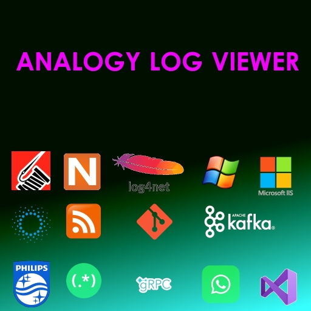

# Overview       
 Overview of projects and their repositories
 
# Analogy Log Viewer

Analogy Log Viewer is multi purpose Log Viewer for Windows Operating systems (with built-in Parser for most commonly used log frameworks).

The application has many standard operations for analysis logs (like filtering, excluding) but its strength is in the ability to add additional custom data sources by implementing few interfaces.
This allows adding any logs formats and/or custom modification of logs before presenting the data in the UI Layer.
Some features of this tool are:
1.	Windows event log support (evtx files)
2.	Logs aggregation into single view.
3.	Search in multiple files
4.	Combine multiple files
5.	Compare logs 
6.	Themes support
7.	64 bit support
8.	Personalization (users settings per user) 
9.	Columns extension to add more columns specific to the data source implementation
10.	Exporting to Excel/CSV files

# Log Viewer Application
The main Analogy Log Viewer app resides at the following repositories:
- [Analogy Log Viewer (DevExpress 19.1.10 version)](https://github.com/Analogy-LogViewer/Analogy.LogViewer). 
- [Analogy Log Viewer (Syncfusion version - developement paused for now)](https://github.com/Analogy-LogViewer/Analogy.LogViewer.Syncfusion).
- [Analogy Log Viewer (Winforms version - not ready for use)](https://github.com/Analogy-LogViewer/Analogy.LogViewer.Winforms). 

# Real Time Data Providers

Analogy Log Viewer has a Real time gRPC Data provider:

| Data Provider   |      CI Status      |  Nuget Version |
|----------|:---------------:|------|
| [gRPC Real Time Data Provider](https://github.com/Analogy-LogViewer/Analogy.LogViewer.gRPC) |  | 

## gRPC Real Time Data Provider

| Nuget   |      Version      |  Description |
|----------|:-------------:|------|
| [Analogy.LogViewer.gRPC](https://www.nuget.org/packages/Analogy.LogViewer.gRPC/) |    | Primary Analogy Log Viewer grRPC providers |
| [Analogy.LogServer](https://www.nuget.org/packages/Analogy.LogServer/) |    | A windows Service for receiving logs |
| [Analogy.LogServer.Clients](https://www.nuget.org/packages/Analogy.LogServer.Clients/) |    | gRPC client to pull back messages from Analogy Service |

# Data Providers
The following custom data providers exists:
### Common Data providers:
| Data Provider   |      CI Status      |  Nuget Version |
|----------|:---------------:|------|
| [Plain Text Parser](https://github.com/Analogy-LogViewer/Analogy.LogViewer.PlainTextParser) |   | 
| [NLog Parser](https://github.com/Analogy-LogViewer/Analogy.LogViewer.NLogProvider)|    |  
| [Serilog Parser](https://github.com/Analogy-LogViewer/Analogy.LogViewer.Serilog) |    | 
| [Log4Net Parser](https://github.com/Analogy-LogViewer/Analogy.LogViewer.Log4Net) |     | 
| [Regular Expression Parser](https://github.com/Analogy-LogViewer/Analogy.LogViewer.RegexParser)|   | 
| [Kafka Producer/ consumer](https://github.com/Analogy-LogViewer/Analogy.LogViewer.KafkaProvider)|   |
| [IIS log Parser](https://github.com/Analogy-LogViewer/Analogy.LogViewer.IISLogParser)|   | 
| [RSS Reader](https://github.com/Analogy-LogViewer/Analogy.LogViewer.RSSReader) |   | 
| [Generic Json Log Parser](https://github.com/Analogy-LogViewer/Analogy.LogViewer.JsonParser)|   |
| [XML Parser](https://github.com/Analogy-LogViewer/Analogy.LogViewer.XMLFileProvider)|  | 
| [Windows event logs](https://github.com/Analogy-LogViewer/Analogy.LogViewer.WindowsEventLogs)|  | 
| [Catel log Parser](https://github.com/Analogy-LogViewer/Analogy.LogViewer.CatelProject) |

### Special Purpose Data providers:
| Data Provider   |      CI Status      |  Nuget Version |
|----------|:---------------:|------|
| [Git History](https://github.com/Analogy-LogViewer/Analogy.LogViewer.GitHistory) |   | 
| [WCF Sender/Receiver](https://github.com/Analogy-LogViewer/Analogy.LogViewer.WCF) |   | 
| [WhatsApp Chat Log Parser](https://github.com/Analogy-LogViewer/Analogy.LogViewer.WhatsApp) |   | 
| [Visual Studio Activity Log Parser](https://github.com/Analogy-LogViewer/Analogy.LogViewer.VisualStudioLogParser) |   | 

### Organizations/Companies Data providers:
| Data Provider   |      CI Status      |
|----------|:---------------:|
| [Kama Research and Development](https://github.com/Analogy-LogViewer/Analogy.LogViewer.KamaResearch) | 
| [Philips I4 BU](https://github.com/Analogy-LogViewer/Analogy.LogViewer.Philips.I4) | 
| [Philips ICAP BU](https://github.com/Analogy-LogViewer/Analogy.LogViewer.Philips.ICAP)  | 
| [MIrada XD logs Parser](https://github.com/Analogy-LogViewer/Analogy.LogViewer.MiradaXD) | 

# Other Repositories

| Data Provider   |      CI Status      |  Nuget Version |
|----------|:---------------:|------|
| [Analogy.DataProviders.Extensions](https://github.com/Analogy-LogViewer/Analogy.DataProviders.Extensions) |     |   
| [Analogy.LogViewer.Example](https://github.com/Analogy-LogViewer/Analogy.LogViewer.Example) |   |  
| [Analogy Interface Project](https://github.com/Analogy-LogViewer/Analogy.Interfaces) |   |  
# Dependencies & Build
- Main Application UI is complied to .Net Framework 4.7.2 and to .Net Core 3.1. The supported version of Visual studio for this framework is Visual studio 2017 (or above).
After successfull build any custom data source assemblies should be placed at the same folder as the executable (Analogy.exe) with the folowing pattern naming: Analogy.LogViewer.*.dll
- Analogy Interfaces assembly is complied to .Net Standard 2.0.

- DevExpress User Controls:
in order to compile the DevExpress version  [DevExpress](https://www.devexpress.com/) assemblies are required (winforms package only).

- Syncfusion User Controls:
[Syncfusion](https://www.syncfusion.com/) has open source license.

## Contact

### Owner
- [Lior Banai](mailto:liorbanai@gmail.com)

## Used by the following Organizations:

